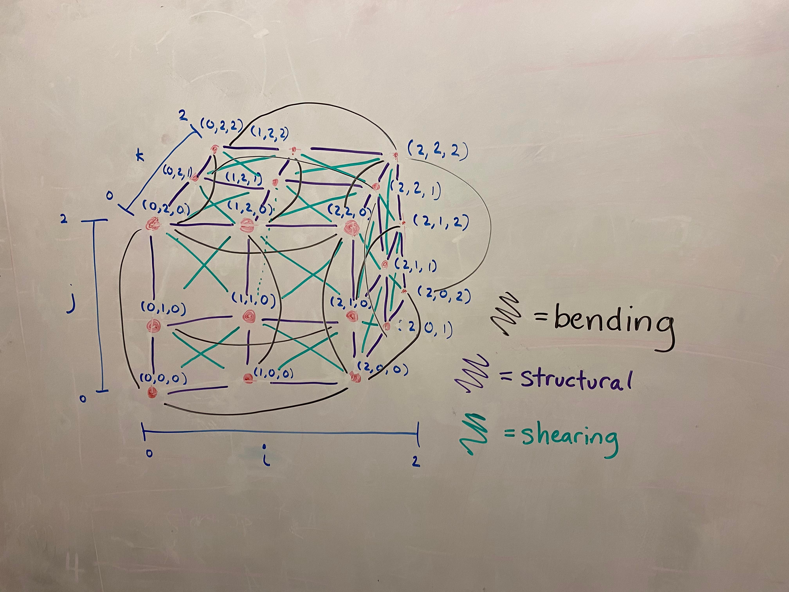
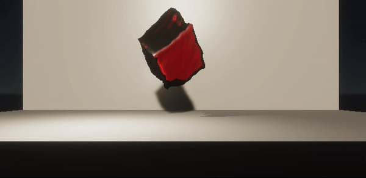

# Milestone

Jello, again!

## Accomplishments

For our project, we chose to learn Unity due to its popularity, capabilities in physical 
simulation and rendering, and potential need for efficiency.

So far, we've implemented a Jello simulation using a mass-spring model. The 
model creates a 3D grid with masses at each vertex and springs connecting
the masses. We chose the springs (structural, bending, and shearing) by extrapolating 
the structure of our cloth simulation. Afterwards, we implemented the mesh generation 
for this model, which creates a triangle mesh from the masses' vertices.

{:style="display:block; margin-left: auto; margin-right: auto; width:30%;"}

Then, we worked with Unity to take our mesh and render it to look like Jello. This took 
some experimenting with the Unity materials and rendering pipelines.

## Preliminary Results
Here's the current state of our simulation and rendering! We added in a listener for 
keypresses which makes the Jello jump upwards.

{:style="display:block; margin-left: auto; margin-right: auto; width:50%;"}

## Reflection
Overall, we thought that our model works well, but there's a couple of issues with the model and our rendering that we'd
want to improve on for our final submission.
- The mass-spring model can be unstable at times, especially when high forces are exerted
- Our render isn't as transparent and realistic as we'd like

Also, our goal is to eventually try using a material point method or other more complicated method to render the
Jello and support collisions with rigid bodies. For example, we want to simulate a bullet striking through
the Jello cube. 
