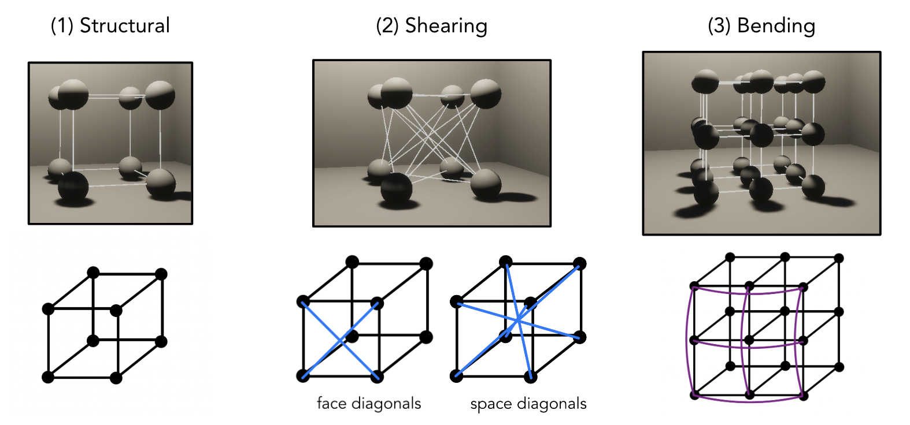
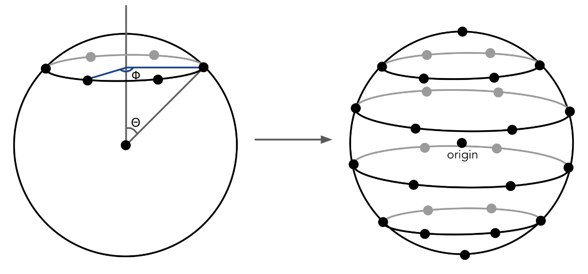
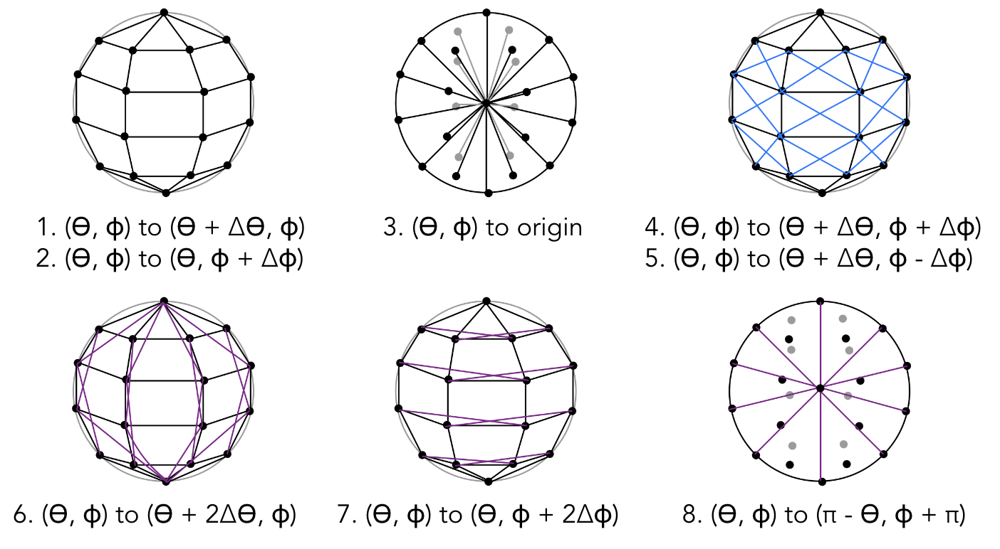

# Final Writeup

[Slides](https://docs.google.com/presentation/d/1ozbsNFH_Sg-njZ_wx_bAXcgFaxxcuOdkhU3FMj_iLkg/edit?usp=sharing)

Jello, world! In our final project, we implemented a realtime Jello simulation in Unity with support for keyboard and mouse interactivity that allows the user to manipulate the Jello. We created two mass-spring systems in the forms of a cube and a sphere and wrote mesh generators for both shapes. Initially, we started with the cube model by extending the 2D cloth model from Project 4 to our 3D lattice of masses and springs. Then, we devised our own algorithm for the sphere model using spherical coordinates and testing different spring configurations. Finally, we tuned spring parameters for realistic renderings. Since we used Unity for our project, we took advantage of the High Definition Rendering Pipeline, allowing us to focus on the construction of the object itself.

## Technical Approach

**Mass-Spring Cube**

Since our Jello supports a variable number of particles per axis, we used a similar implementation to Project 4 when deciding where to place each particle by computing a constant offset distance between each particle. We initialized an $$N \times N \times N$$ lattice of particles to prevent from underconstraining later when adding springs.

We took advantage of our existing knowledge of the spring system in project 4 and expanded the definitions of each spring to apply to three-dimensional space. Structural constraints join adjacent vertices along each axis, bending constraints skip a vertex in a certain axis, and shearing constraints join adjacent vertices along face and space diagonals. Below is a diagram illustrating the springs between each particle:

{:style="display:block; margin-left: auto; margin-right: auto; width:50%;"}

**Mass-Spring Sphere**

We devised our own algorithm from scratch to initialize vertex positions and add springs for our spherical mass-spring model. 

Initializing the particles for a sphere was more complicated. To simplify the design, we chose to leverage the spherical coordinate system with angles $$(\theta, \phi)$$. We loop through the two coordinates in equal increments to set positions for each point by transforming back to the Cartesian grid: $$x = R\sin(\theta)\cos(\phi)$$, $$y = R\cos(\theta)$$, and $$z = R\sin(\theta)\sin(\phi)$$. After accounting for the edge case at the poles (e.g. $$\theta = 0$$ or $$\theta = \pi$$) which should only have one particle, we initialized one final particle at the origin. We’ll elaborate on the usage of this origin particle later.

We had to experiment a bit to see what springs were necessary to constrain our system. Similar to structural, shearing, and bending springs, we first connected all particles to (1) their direct neighbors by incrementing $$\theta$$ and $$\phi$$, (2) their diagonal neighbors, and (3) springs connecting every other vertex in both angular dimensions. At this point, we found that the sphere deformed too easily, as there were only enough particles to simulate its skeletal surface but nothing representing the inside. As a result, we added springs connecting the origin to all the other particles to prevent too much deformation. Still, we needed to constrain the sphere further, so we added springs connecting each vertex to its polar opposite vertex radially through the origin.

| Vertices | Springs |
| --- | --- |
| {:style="display:block; margin-right: auto; width:90%;"} | {:style="display:block; margin-right: auto; width:90%;"} |

**Mesh Generation**

For both the cube and the sphere mesh, we used Unity's built-in triangle Meshes based on an indexed triangle representation. For every vertex on the outer surface of the body, we track the position in a vertex list. Then, we describe triangles as triplets of indices within the vertex list $$(i_{v1}, i_{v2}, i_{v3})$$. A tricky aspect of creating the mesh was being intentional about making sure that all the triangles were in a consistent winding order so that the normals were pointed outwards.

**Interactivity**

We implemented two types of interactivity: (1) movement with WASD and space and (2) click-and-drag to manipulate vertices.

The WASD keys allow the user to control the Jello in the $$x-z$$ plane. Upon every update, we detect keyboard inputs. For instance, if the W key is pressed, we add velocity in the $$+z$$ direction to the rigid body component of every unique particle in the object. We also supported spacebar inputs to make the Jello jump in the $$+y$$ direction.

To support clicking and dragging our Jello, we track the position of the mouse and send out a ray from the mouse onto the object until it intersects with one of the vertices. From the $$z$$ coordinate of this intersection point, we can detect the current depth of the object. Thus, we can effectively treat any mouse movement in 2D screen space as only changing the x and y coordinates of the object along the intersected plane.

**Challenges**

As this was all of our first times working with Unity, we ran into a number of challenges:
1. **Distributing particles in our spherical mass spring system:** We found there was a tradeoff between computational efficiency with fewer particles and sufficiently constraining the system with springs so that the object remained stable. At first, we only added particles to the outer face of the sphere and distributed them evenly. However, to adequately constrain the system, we also added a particle in the origin that was connected to every other particle in the system (much like a bicycle wheel and its spokes). Another issue we originally faced with setting particle positions was that we had to special case $$\theta = 0$$ and $$\theta = \pi$$ because rotating these positions in $$\phi$$ should result in the same vertex.
2. **Decreasing the vertex particle size deformed our system:** 
We concluded that the structure of our objects was maintained via the particle collisions, and kept the particle sizes large enough but didn’t render the particles themselves. We’re still not completely sure whether the deformations were caused by precision errors when calculating the normals or the mass of the particle decreasing as the size of the particle also decreases, which would cause spring correction forces to apply an outsized impact on the particles.
3. **Choosing the sphere model's spring configuration:** During many early iterations of our design, we found that many spring configurations were underconstrained, resulting in erratic motion and deformation. As a result, we added an origin point with springs connecting to all outer vertices as well as other sets of springs that connect polar opposite vertices. Additionally, we found that lowering the spring constant to the 100-5000 range led to the best results.
4. **Resting Jello does not stabilize:** Even when resting in place, our Jello would still continue to move. Introducing damping and friction on each vertex so the object would eventually come to rest.

## Final Results

In the videos below, we capture the primary features of our Jello! You can see the cube and spherical Jellos we implemented, as well as applying movement and jumping commands to the objects.

| Bowl (Cube) | Bowl (Sphere) | Ramps |
| --- | --- | --- |
| {:style="display:block; margin-right: auto; width:90%;"} | {:style="display:block; margin-right: auto; width:90%;"} | {:style="display:block; margin-right: auto; width:90%;"} |
{:style="margin-bottom: 10px;"}

We also played around with the spring constant to manipulate the rigidity of the Jello. As you can see, lower spring constants make the Jello more jiggly, analogous to an extra bouncy bit of jello! Naturally, a higher spring constant meant that the system would settle quicker. Interestingly, the bounce height for the cube seemed to increase then decrease as the spring constant increased. This might be because lower spring constants could not apply enough force to lift the Jello while higher spring constants do not deform enough to spring the Jello upwards.

{:style="display:block; margin-left: auto; margin-right: auto; width:90%;"}

## References
From a high level, other than referencing documentation on how certain built in tools for Unity worked, we used trial and error when building
- ClothSim served as the basis for the way we went about building the mass-spring system, as well as the springs we attached to the cube object. 
= To translate the springs from 2-D to 3-D for the cube object specifically, we referenced slides by [Carnegie Mellon University’s Fall 2002 offering of Computer Graphics 15-462](https://www.cs.cmu.edu/~barbic/jellocube_bw.pdf)
- [Unity documentation on how the mesh class works](https://docs.unity3d.com/Manual/UsingtheMeshClass.html) so we know the appropriate information to supply when rendering the mesh.

